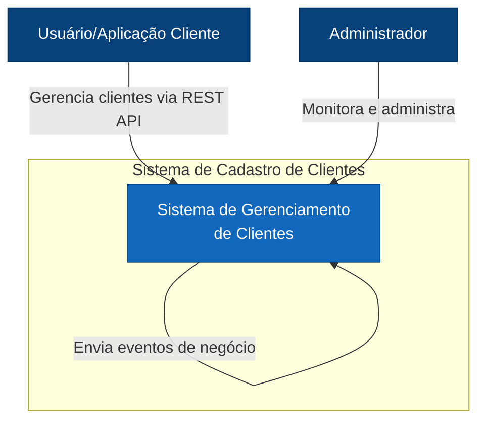
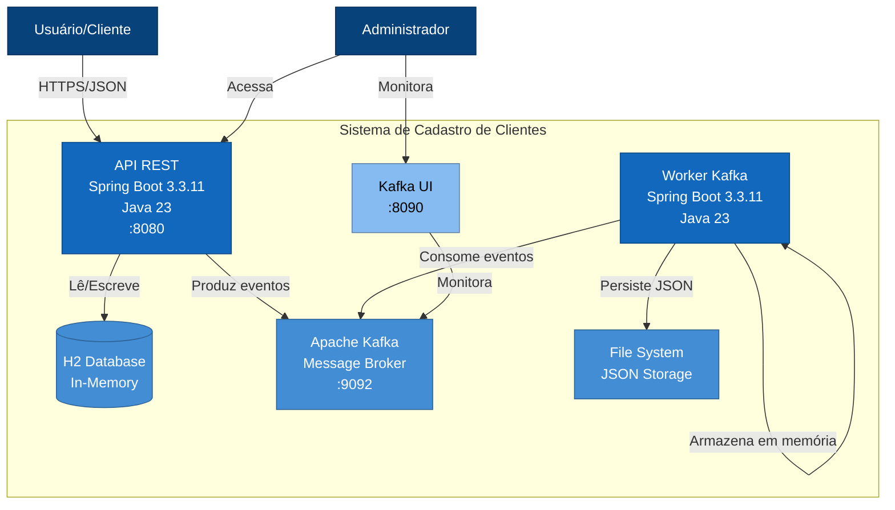
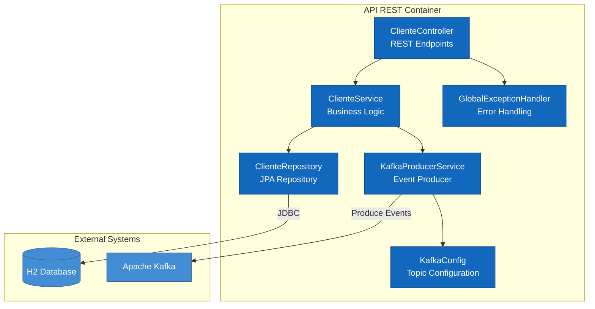
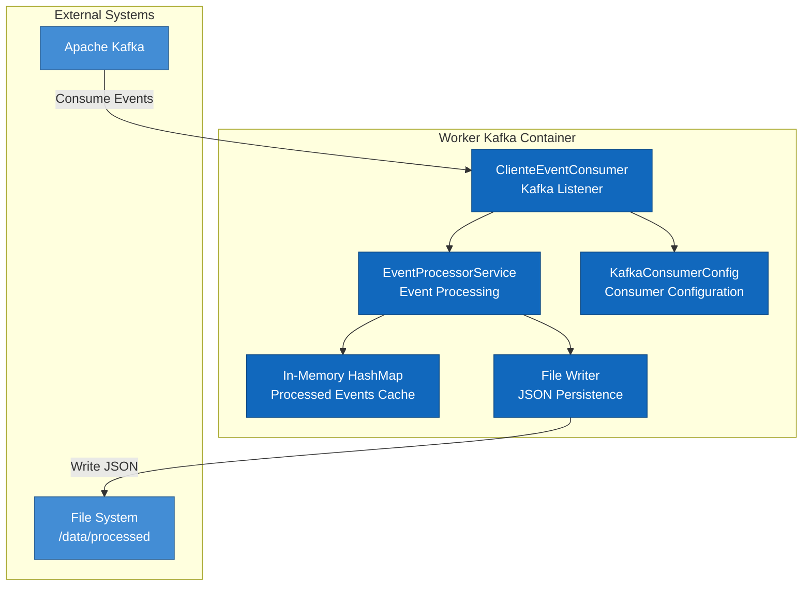
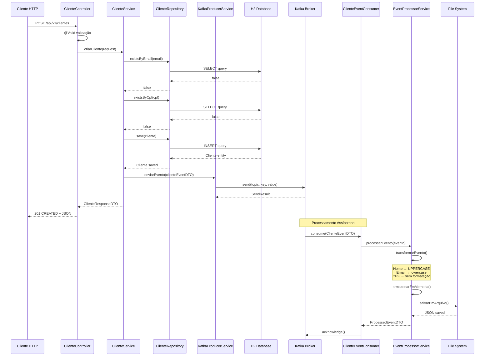
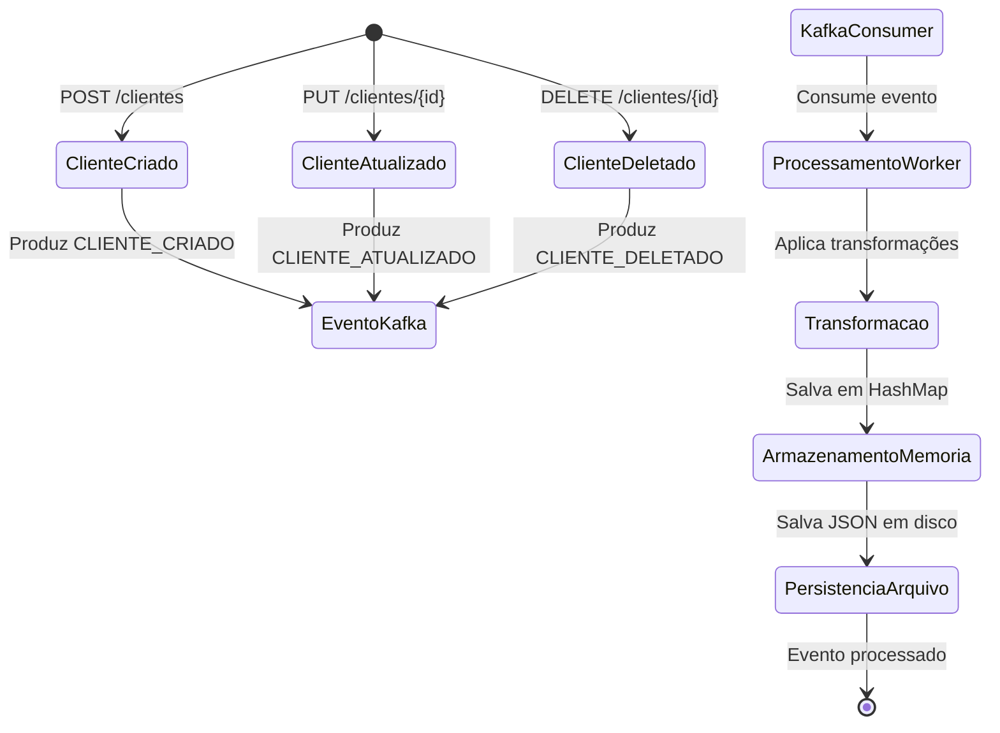
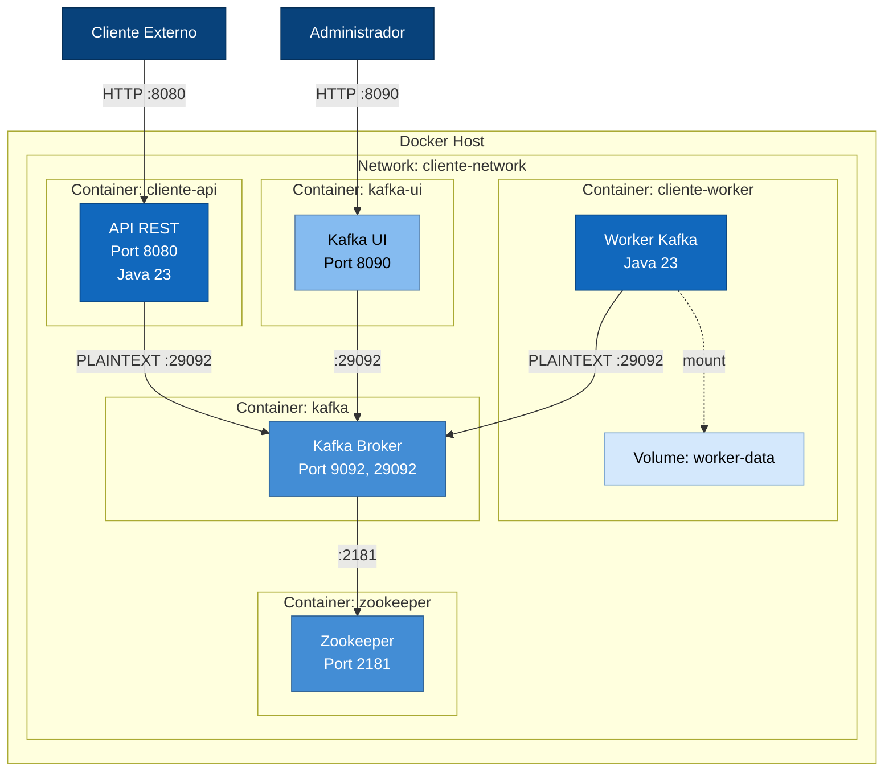

# Diagramas C4 Model - Sistema de Cadastro de Clientes

## Nível 1 - Diagrama de Contexto

## Nível 2 - Diagrama de Containers

## Nível 3 - Diagrama de Componentes (API REST)

## Nível 3 - Diagrama de Componentes (Worker Kafka)

## Nível 4 - Diagrama de Código (Fluxo de Criação de Cliente)

## Diagrama de Fluxo de Eventos

## Diagrama de Deployment

---

## Descrição dos Níveis C4

### Nível 1 - Contexto do Sistema
Visão geral do sistema mostrando como ele se encaixa no mundo ao seu redor, incluindo usuários e sistemas externos.

### Nível 2 - Containers
Mostra a arquitetura de alto nível do sistema com seus principais containers (aplicações, bancos de dados, etc.).

### Nível 3 - Componentes
Detalha os componentes dentro de cada container, mostrando suas responsabilidades e relacionamentos.

### Nível 4 - Código
Mostra como o código é organizado dentro dos componentes, com diagramas de sequência para fluxos principais.

---

## Tecnologias por Camada

| Camada | Tecnologia | Versão |
|--------|-----------|---------|
| Linguagem | Java | 23 |
| Framework | Spring Boot | 3.3.11 |
| Build Tool | Maven | 3.8+ |
| Message Broker | Apache Kafka | 7.6.0 |
| Database | H2 | In-Memory |
| API Documentation | SpringDoc OpenAPI | 2.3.0 |
| Containerization | Docker | Latest |
| Orchestration | Docker Compose | 3.8 |

---
**Vers\u00e3o:** 1.0.0  \n**Data:** Fevereiro 2026  \n**Autor:** Antonio Luiz\n\n---
**Nota:** Estes diagramas seguem o padrão C4 Model criado por Simon Brown e representam a arquitetura completa do sistema de cadastro de clientes.
